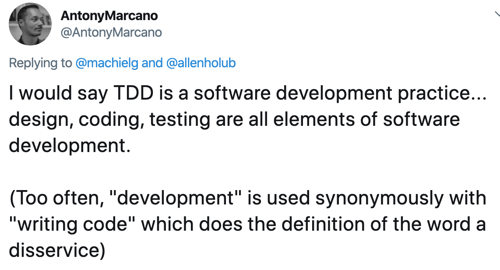
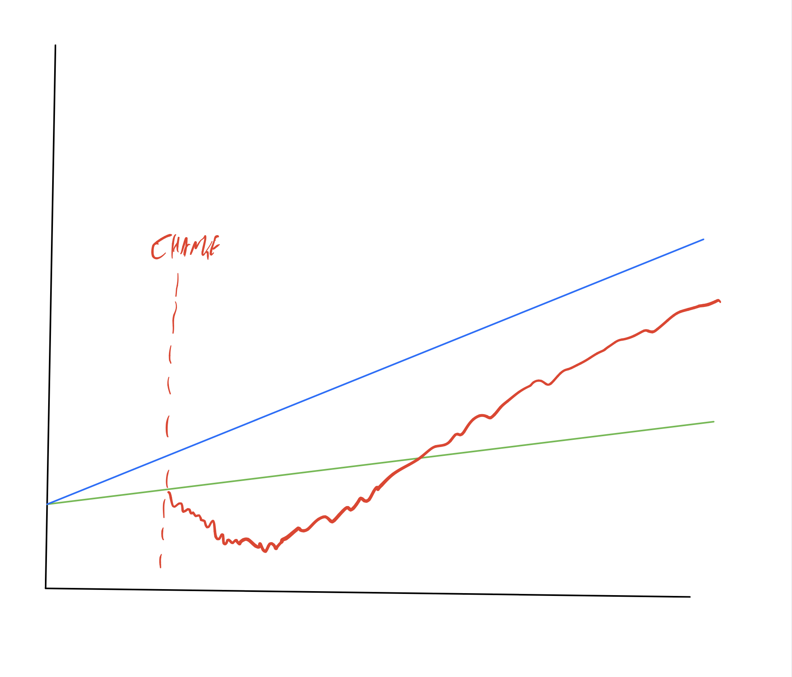
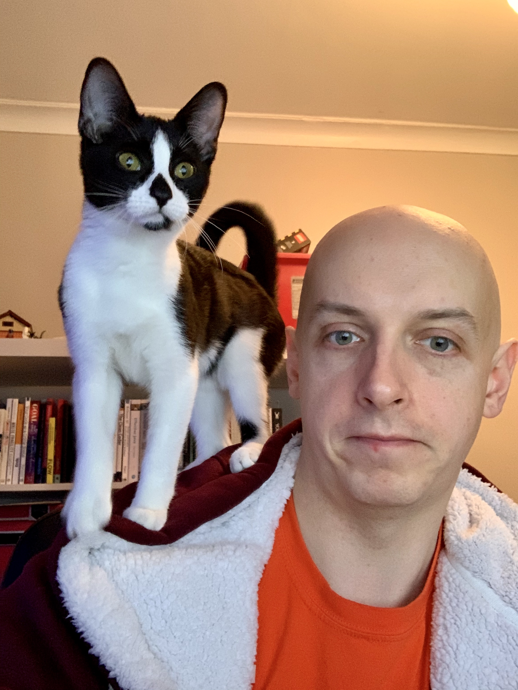

theme: Ostrich, 1
footer: @garyfleming

[.background-color: #FFF]
[.hide-footer]

^ TODO ADD WAY MORE CODE EXAMPLES

^ This is a sudoku puzzle. It's a pretty simple idea that can be quite complicated if you're not used to it. It's a 9x9 grid, separated into 9 3x3 boxes. You solve it by placing the numbers 1-9 exactly once in each column, each row, and each 3x3.

---

[.background-color: #FFF]
[.hide-footer]

^ I remember them first becoming popular in the UK when I was at university. Various newspapers would print them beside the traditional crossword puzzle. I always found them frustrating. This one was graded as easy. Of the 81 cells, 38 cells are already filled. About half. Most people, given the rules, can figure them out with a bit of time and guessing. These ones were not why I was frustrated.

---

[.background-color: #000]
[.hide-footer]

^ This is a sudoku graded at Expert. 23 cells are prefilled. It's much harder. There's an entire box without numbers. How do you fill this in?, I though.. Pure witchcraft. I gave up.

---

[.background-color: #FFF]
[.quote: #00]
[.hide-footer]

> I wasn't good at it right away, so I quit.

^ In the immortal words of Bart Simpson... I didn't study, I didn't read up on techniques, I didn't even try all that hard.

---

[.background-color: #FFF]
[.hide-footer]

^

---

# TDD is My Shame
### A Preview

^ My name is... I am a... from... focussing on...
^ That's my twitter handle. If I say something you like and you mistakenly believe I might say other things you'll like, that's the place I'm likely to say them.

---

[.header: alignment(left)]

## Part 0:
## A Journey into Shame

---

^ I run a meetup called CodeCraft, that focusses on the craft of writing good software. It was kind of a spin-off from this meetup... Don't worry, this isn't a pitch for that meetup: it's just where the story starts.

---

^ A few years ago, we were running a session on either mob or pair programming, I don't remember which, but there was an unusual argument that broke out in one of the groups but dissipated before we could intervene and figure out what was wrong.

---

# Pub / Plato

^ Afterwards, a few of us went to a nearby pub, given the grey miserable weather, to continue our conversation. One of the attendees, who I'll call Plato, seemed unusually perturbed. When I asked him, what was wrong, he mentioned that he was feeling some pretty severe imposter syndrome after the session. Plato looked deeply uncomfortable, in a way that only a 2500 year old man whose world view has been crushed can. The argument had made him realise something:

---

> "I'm a little ashamed, but I don't TDD as much as I think I should."

^ There's a *lot* packed into that one little sentence. Layers, and nuance, and meaning. We decided to spend a while dealing with it.

---

^ Since that conversation on that night, all those years ago, I've spoken and attended a number of conferences and meetups around the world. As a consultant, I also get to work with a lot of developers of different ages, backgrounds, etc. When I can, I keep asking people the same question:

---

"Do you TDD?"

^ Put your hand up if you've do TDD for most of your production code?

^ The phrasing changes, the context shifts, but I've asked a tonne of developers how and when they TDD. While no-one does it 100% of the time (well, one person claimed to, but we'll introduce him later), one thing that's become very clear to me: the number of developers who routinely do TDD is *miniscule*. Tiny. A fraction of a percent. And it appears to be getting smaller.

---

# Shame

^ Worse, it appears to regularly be accompanied by shame. People feel they ought to do TDD, but they don't, and they often can't articulate why.

---

# What is Shame?

^ So what is shame? I'm clearly not a psychologist, psychiatrist, or therapist, so I'll tread pretty lightly here. Shame is rooted in vulnerability, but manifests in many ways. A number of things can contribute to the experience of shame.

---

# What is Shame?

* Self-awareness
* Self-blame
* Standards
* Personal trait
* Self-esteem
* ... and more

^ Sometimes it's simple social faux pas (turning up to a social event wearing casual when everyone else is formal),
sometimes it's looking for causation and coming up short so blaming yourself,
Breaching some kind of standard convention like laughing unexpectedly at a funeral,
It can be low self-esteem - directing things going wrong at yourself as an almost reflexive action

---

## "Listening To Shame" by Brené Brown

^ There's a great TED talk by Brene Brown called... It's worth watching the whole thing but I want to call attention to something she points out about how Shame manifests differently for men and women

---

> "Shame, for women, is this web of unobtainable, conflicting, competing expectations about who we're supposed to be. And it's a straight-jacket. "
> - Brené Brown

^ (Read the quote. Pause) I'm sure that might resonate with some of you. For men, it's mostly just one thing.

---

# Don't be Weak

^ Don't be weak. A whole bunch of societal damage has been done and continues to be done by the self-reenforcing idea that men mustn't be weak. That's a whole talk... maybe a whole series of podcats.... all by itself..

---

# TDD and Shame

^ So what is it all these developers are experiencing when they say they don't do TDD, and why? It probably really is shame. It's yet another thing for them to do that they don't; a reminder of their lack of perfection. It's another way in which society might perceive them as weak.

---

# You're Good Enough

^ As much as I'm going to spend the rest of this talk telling you about how great TDD is and how to do it, you are good enough. You don't need to feel bad about not doing it. You're not better if you do. Do what you can. Learn what you can. But you're good enough.

---

[.background-color: #FFF]
[.hide-footer]

^ TODO Remind people of the rules. Give a quick strategy for beginners

---

## Part 1. What is TDD?

^ TODO spent a long time not talking about it

---

* Testing practice... Not really
* Design Strategy... Maybe
* Development practice... Probably

^ TODO write some thoughts on this

---

^ TODO I like this by Antony Marcano. It's about Development. Because professional soft dev is more than just writing code. It's harmfully narrow in many ways when devs think their job is only churning out code. That's the last thing you should do. Code is a liability. Write as little as you can, and ensure the code you do write is well-designed and well-tested.

---

# No One True TDD

^ I also explained that there really isn't one thing called TDD. We like to pretend that TDD is a thing and you can just do it... but that's not quite true. The practices involved and the processes and the people doing it all... mush together. RJ says That's how ideas are. Mushy. It's like a bunch of different play-doh making up something.

---

# Anchor Terms

^ Liz Keogh describes TDD as an anchor term. It's a useful term for searching and tying these mushy ideas together. If you want to know more about ideas in the space, searching for TDD will probably tell you something useful; which is better than trying to find all the individual practices.

---

# Unit tests

^ TDD isn't unit testing but you helps to understand it first. What is a unit? Turns out most of the folk around at that point in time kinda disagree with each other. It's a mushy idea. What they do agree on?

---

# Unit tests

* No Database
* No network
* No Filesystem
* Must be Parallelisable
* Can't have any weird environment set-up

^ (explain each). What's the intent here? That it's fast and isolated. That it's reliable and deterministic. That it's repeatable. Flaky unit tests are worse than no unit tests.

---

# Metz Says

* Thorough
* Stable
* Fast
* Few

^ Sandi Metz (POODR) says they should be thorough (logical and complete), Stable (doesn't break when impl details change, without changing behaviour), Fast (don't get run otherwise, lose value), Few (as small as possible to express ourselves)

---

# Test First / Test-Driven Development

^ Now we know what a unit test is, in some vague sense, what is TDD? Just writing the tests first? Well, no, writing the tests first might imply you have already got a fully formed design in mind. Meanwhile, TDD practioners will make it clear that while upfront thinking and design is usually required, they want to allow the forming of the tests to help them do a significant chunk of that. I don't want to be too pedantic or pernickety about this distinction, though.
^ TODO graphic showing thinking and design happening through tests...

---

# The basics: Red - Green - Refactor

^ TODO show a diagram
^ The most common thing a TDDer will tell a beginner about is the red green refactor loop.
You start by expressing the thing you'd like the code to do that it doesn't currently do by writing a test. What, not how. Idea, not implementation.

---

# Common gripes: Must. See. Test. Fail

^ TODO marco rogers tweet?

---

# Common gripes: The loop should be much smaller.

^ TODO

---

# Common gripes: People think refactoring means rewrite

^ TODO

---

# Common gripes: People forget to Refactor

^ TODO

---

# Common gripes: Red - Green - Refactor isn't enough

^ TODO not enough Requires thought and judgement.

---

---

---

TODO Everything below here might get cut.

---

# Why feel shame?

^ I asked Plato why he felt SHAME specifically. He said that he found the whole idea overwhelming: it was too big, and any time he'd tried he failed, and he'd never know enough. This was imposter syndrome manifest.. I offered three pieces of advice

---

# 1. Satir(ish)

^ TODO Virgina Satir was a therapist. Did a lot of work on change. Can't get into the details here, but well worth reading her work

---

^ explain the changes

---

# 2. No One True TDD.

^ I also explained that there really isn't one thing called TDD. We like to pretend that TDD is a thing and you can just do it... but that's not quite true. The practices involved and the processes and the people doing it all... mush together. RJ says That's how ideas are. Mushy. It's like a bunch of different play-doh making up something.

---

# Anchor Terms

^ Liz Keogh describes TDD as an anchor term. It's a useful term for searching and tying these mushy ideas together. If you want to know more about ideas in the space, searching for TDD will probably tell you something useful; which is better than trying to find all the individual practices.

---

# 3. Shu-Ha-Ri

^ Everyone is a beginner. That's okay. That's how we all start. There's an idea, that is somewhat misunderstood but probably applies here: shuhari.

---

# Obey - Detach - Separate

---

* Do the moves
* Understand the moves
* Move beyond the moves

---

# Sudoku

^ TODO

---

# Easy

^ TODO

---

# Expert

^ TODO

---

# Find some guides. Try them.

^ Red/green/refactor etc. Try these things. Keep trying them study. You'll learn more about when they work and when they don't

---

# You can do it

^ You might not think this story applies to you because you're not a developer. You're mistaken. This applies to most skills and practices.

---

1. Change Takes Time -- Satir
2. Practices are messy -- No One True....
3. Learn from experts, move on -- Shu-ha-Ri

---

# Thank You

@garyfleming
